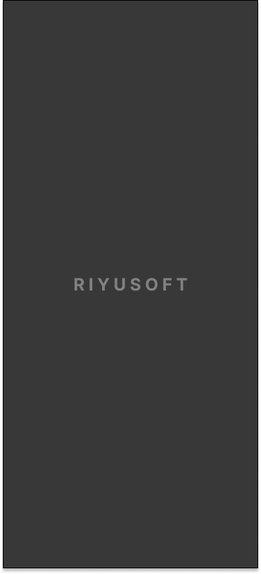

# aos-todo-cleanarch-compose-tdd
안드로이드 Todo앱 with 클린 아키택쳐 , 컴포즈 , TDD
===========================================

-안드로이드 개인 학습 및 공유를 위한 할일 리스트 어플리케이션 만드는과정간 클린아키택쳐, 컴포즈, TDD, DI 등을 적용하여 프로젝트를 완성하는 프로젝트임.

## Screenshots

## 목표 리스트(2022.08.03기준이며 지속 업데이트중)
1. 클린아키텍쳐를 이해한다( 어니언 구조 : presentation, domain, data )
2. Compose를 이해한다
3. DI(hilt)를 이해한다
4. TDD 및 테스트를 이해한다
5. JetPack 라이브러리들을 이해한다
   1. App Startup
   2. Room
6. CI/CD를 이해한다
   1. 구글 플레이스토어 자동 배포
